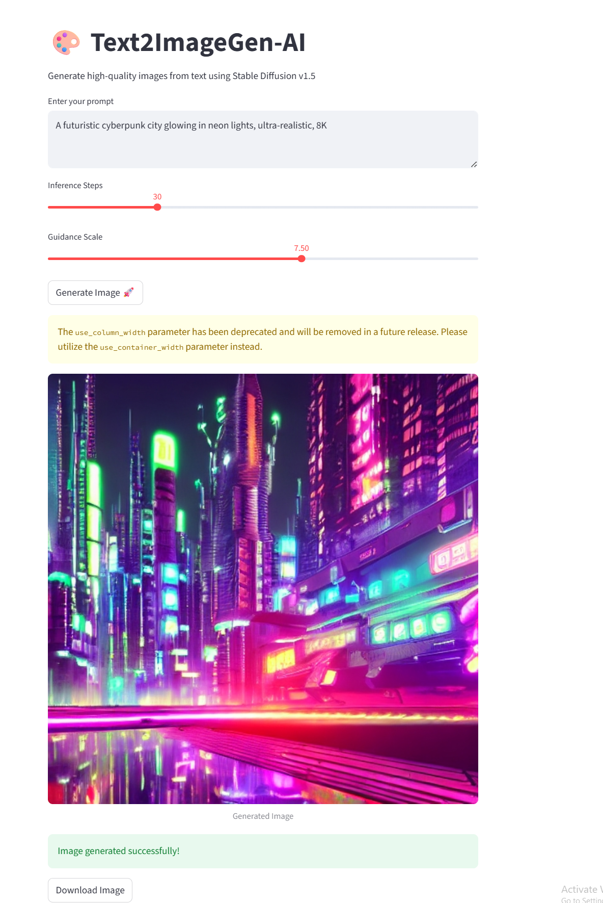

# 🎨 Text2ImageGen-AI
### Text-to-Image Generator using Stable Diffusion v1.5 + Streamlit

A clean, fast and powerful text-to-image generation app built using:

- 🧠 **Stable Diffusion v1.5**
- ⚡ **Diffusers**
- 🎨 **Streamlit**
- 🔥 **Torch (CUDA supported)**

This project turns natural language prompts into high-quality images.

<p align="center">  </p>


---

## 🚀 Features  
- ✔️ Generate high-quality images from text

- ✔️ Supports SD, SD Turbo, SDXL, Open Source LLMs

- ✔️ Adjustable: Steps, Guidance Scale, Resolution

- ✔️ Live preview in Streamlit

- ✔️ Image download option

- ✔️ Local inference or HuggingFace API 

---

## 📂 Project Structure  
```
Text2ImageGen-AI/
│── app.py
│── models/
│     ├── your_model_files_here...
│── samples/
│     ├── sample_prompts.txt
│     ├── demo.png
│── requirements.txt
│── README.md

---

## 🛠️ Installation  
```
pip install -r requirements.txt
streamlit run app.py

```

---

## 📘 Sample Prompts  
See `samples/sample_prompts.txt` for high-quality prompts.
Examples:

“Cyberpunk city with neon lights, ultra-detailed, 4K”

“Cute robot learning to paint, Pixar style”

“Ancient temple floating in the clouds, epic lighting”

“Tiger wearing sunglasses on a beach, hyperrealistic”

---

## 🧪 Testing  
Run:
```
streamlit run app.py

```

---

## 📝 License  
MIT License – free for personal & commercial use.

---

## 🤝 Contributing  
PRs are welcome.  
Raise an issue if you want GPU acceleration or LangChain integration.

---

## ⭐ Show Your Support  
If you like this project, please ⭐ star the repo!

